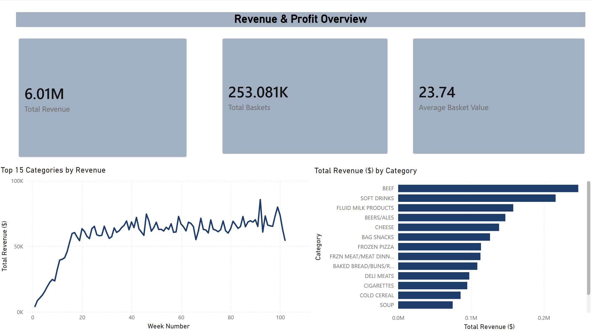
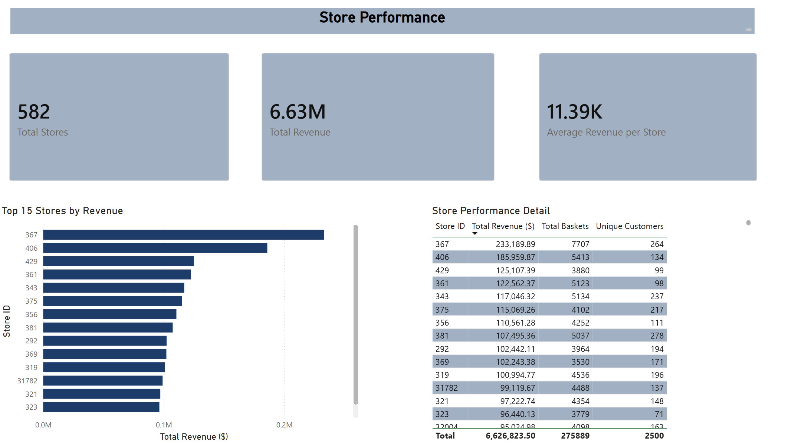
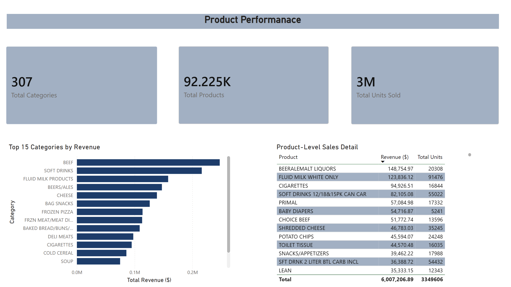
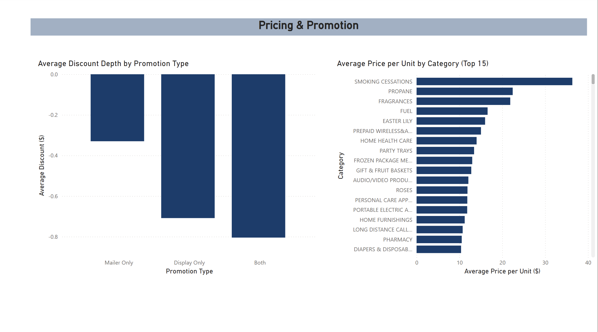
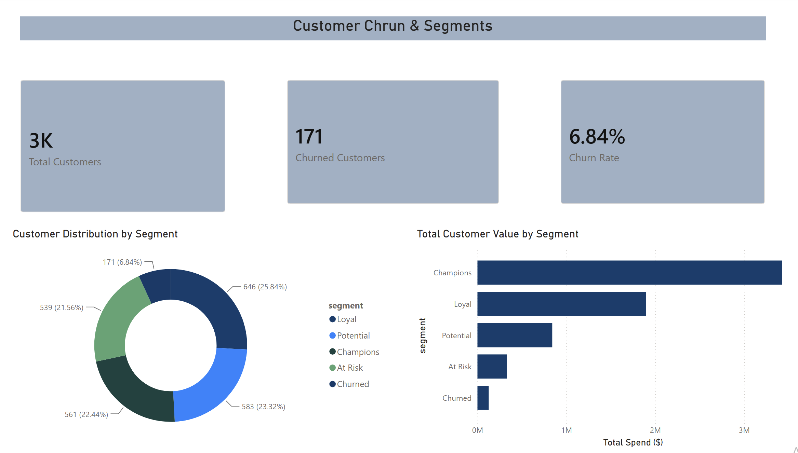
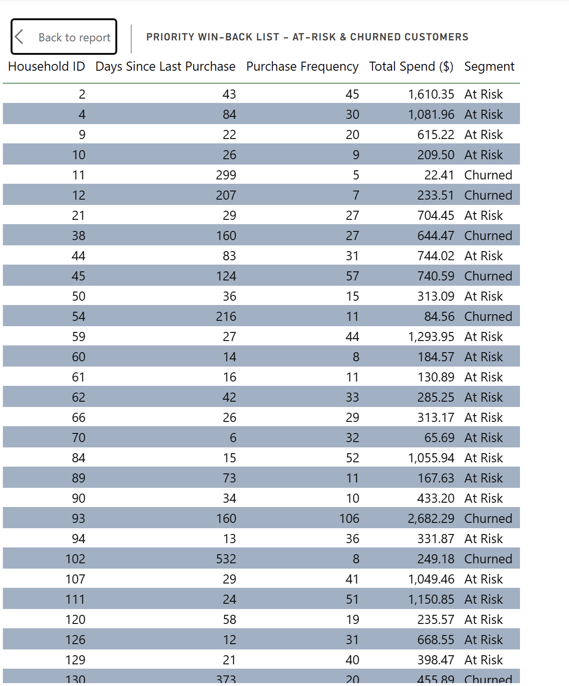

# Retail Analytics Dashboard — End-to-End Data Pipeline

An end-to-end retail analytics project simulating the analytics function of 
a grocery retail chain — covering revenue, store performance, product 
performance, pricing, and customer churn/segmentation — built on a real 
2-year grocery transaction dataset.

**Pipeline:** Kaggle API → Python (pandas) → MySQL → Power BI

## Overview

This project analyzes 2 years of transaction data from ~2,500 households 
across a US grocery retailer, using the [Dunnhumby "Complete Journey"](https://www.kaggle.com/datasets/frtgnn/dunnhumby-the-complete-journey) 
dataset. It demonstrates an end-to-end analytics workflow: programmatic data 
ingestion, data cleaning and quality investigation, customer segmentation via 
RFM analysis, a relational database layer, and a multi-page interactive Power 
BI dashboard.

The project is structured around six business questions a retail analytics 
team would typically be asked to answer:
1. How is revenue trending, and what's driving it?
2. Which stores are performing well or poorly?
3. Which products/categories drive the most value?
4. How effective are our promotions, and how is pricing positioned across categories?
5. What does our customer base look like, and how many are churning?
6. Which high-value customers need a win-back campaign?

## Architecture

```
Kaggle API
    │
    ▼
Python (pandas) — cleaning, quality checks, RFM/churn analysis
    │
    ▼
MySQL — relational schema, SQL analysis queries
    │
    ▼
Power BI — 6-page interactive dashboard
```
## Tech Stack

- **Data Source:** [Dunnhumby "Complete Journey"](https://www.kaggle.com/datasets/frtgnn/dunnhumby-the-complete-journey) (Kaggle)
- **Ingestion:** Kaggle API
- **Data Cleaning & Analysis:** Python (pandas), Jupyter Notebook
- **Database:** MySQL, SQLAlchemy
- **Visualization:** Power BI Desktop
- **Version Control:** Git / GitHub

## Data Source

This project uses the Dunnhumby "Complete Journey" dataset - real household-level 
transaction data from a US grocery retailer, covering 2 years (~2,500 households, 
2.5M+ transactions, 92,000+ products). It includes purchases, household 
demographics, promotions (in-store displays and mailers), and coupon activity.

**Note:** This is not Woolworths data specifically - Woolworths does not publish 
transaction-level data publicly. This project uses a comparable, publicly 
available grocery retail dataset to demonstrate the same analytical approach 
(revenue, store/product performance, pricing, churn) that would apply to any 
grocery retailer's data.

## Data Cleaning Decisions

A few data quality issues were investigated and resolved during cleaning - 
documented here since they reflect real analytical judgment calls, not just 
mechanical processing:

- **Zero-quantity transactions (14,466 rows):** Found to be coupon-only 
  adjustment line items, not genuine purchases. Removed from the transaction 
  dataset since they'd distort quantity-based metrics.
- **Extreme quantity outliers:** A small number of transactions (<1%) had 
  quantity values in the tens of thousands - traced to weight/volume-based 
  items (primarily fuel). Capped at quantity ≤ 100 for unit-count metrics; 
  revenue figures were unaffected since they're based on sales value, not quantity.
- **"Coupon/Misc Items" category:** This category unexpectedly ranked #1 by 
  revenue. Investigation showed 84% of its transactions were gasoline sales, 
  not grocery products - excluded from product-level analysis to keep 
  category insights meaningful.
- **Churn definition:** Defined as no purchase in 90+ days, based on the 
  observed recency distribution (75th percentile = 20 days). Churn status 
  overrides RFM segment assignment, so historically high-value customers who've 
  gone quiet are correctly flagged as "Churned" rather than hidden inside 
  "Champions."
- **Promotion data baseline:** The causal (promotion) dataset only tracks 
  product-store-weeks with recorded display or mailer activity - there's no 
  true "no promotion" baseline in this dataset. Promotion comparisons are 
  relative across promo types, not against an untouched control group.

## Dashboard

### Page 1: Revenue & Profit Overview


- Total revenue of $6.63M across 275,889 baskets over 2 years, averaging 
  $24.02 per basket
- Revenue grew sharply in the first ~20 weeks before stabilizing around 
  $65K–90K/week
- BEEF is the top revenue-generating category ($247K), followed by soft 
  drinks and dairy - fresh/perishable categories dominate top-line revenue

### Page 2: Store Performance


- Store 367 is the clear top performer at $233K revenue - nearly 25% higher 
  than the second-ranked store
- Revenue is fairly concentrated among the top-performing stores
- Store performance doesn't correlate purely with basket count - some 
  high-basket stores have lower average basket value, suggesting different 
  customer profiles per location

### Page 3: Product Performance


- 307 distinct product categories generated $6M+ in revenue from 92,225 
  unique products
- Excluded a "Coupon/Misc Items" category after discovering 84% of its 
  transactions were gasoline sales - a data quality catch that would have 
  misrepresented "top category" if left in
- High-revenue categories don't always mean high-volume: Beer/Malt Liquors 
  generates strong revenue ($148K) from moderate volume (20K units), while 
  soft drink multipacks drive high volume (55K units) at lower revenue per unit

### Page 4: Pricing & Promotions


- Products promoted through both display and mailer channels together show 
  the deepest average discounting (~$0.80), compared to ~$0.33 for 
  display-only - suggesting combined promotions are used for the most 
  aggressive markdowns
- Premium/niche categories (Smoking Cessation products, Propane, Fragrances) 
  command the highest price-per-unit, while everyday grocery staples sit at 
  the lower end
- Average price per unit and discount rate were calculated directly in Power 
  BI using DAX measures on the transactions and products tables

### Page 5: Customer Churn & Segments


- 6.84% of the customer base (171 of 2,500 households) has churned (90+ days 
  without a purchase)
- Despite being just 22.4% of customers, "Champions" drive over 50% of total 
  customer spend ($3.4M of ~$6.6M) - a Pareto-style concentration of value
- Churned customers still show meaningful historical value (avg. $744 
  lifetime spend, 35 purchase frequency) - comparable to or above the 
  "At Risk" segment — indicating churn represents a real win-back 
  opportunity, not just customer loss

### Page 6: Customer Value / At-Risk


- The highest-value churned customer had spent over $5,180 historically 
  before going quiet for 141 days - exactly the kind of customer a retention 
  campaign should prioritize
- This page converts the churn analysis into an actionable list - ranked by 
  historical spend - that a retention/marketing team could directly use for 
  win-back outreach

## How to Reproduce

1. Clone this repository
2. Get a Kaggle API token from [kaggle.com/settings](https://www.kaggle.com/settings) 
   and place it at `~/.kaggle/kaggle.json`
3. Set up a Python environment:
```bash
   conda create -n retail-project python=3.12 -y
   conda activate retail-project
   pip install pandas numpy kaggle pymysql sqlalchemy jupyter matplotlib seaborn scikit-learn
```
4. Run `sql/schema.sql` in MySQL to create the database structure
5. Open `notebooks/01_data_pipeline.ipynb`, update the `password` variable 
   with your own local MySQL password, and run all cells
6. Run the queries in `sql/queries.sql` to explore the data, or open 
   `dashboard/retail_analytics.pbix` in Power BI Desktop (update the MySQL 
   connection details to match your local setup)

## Repository Structure

```
retail-analytics-project/
├── data/raw/              # Dataset (not committed — see reproduce steps)
├── notebooks/
│   └── 01_data_pipeline.ipynb
├── sql/
│   ├── schema.sql
│   └── queries.sql
├── dashboard/
│   ├── retail_analytics.pbix
│   └── screenshots/
└── README.md
```
